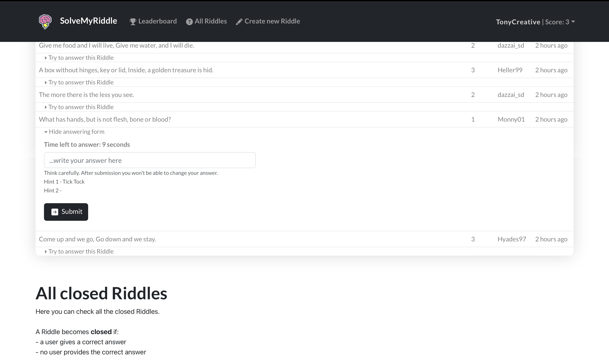

# Exam #2: "SolveMyRiddle"
## Student: s303503 DE CINQUE ANTONIO

## React Client Application Routes

- Route `/`: Displays homepage with all riddles, divided between closed and open Riddles. Dynamic rendering: if user is authenticated shows only closed Riddles. otherwise it shows closed and open Riddles.
- Route `/login`: Displays a form for the user to log into their account
- Route `/leaderboard`: Displays a table with top 3 users
- Route `/newriddle`: Displays a form for the creation of a new Riddle
- Route `/myRiddles`: Displays the riddles created by a certain user. The user can see all the answers given on their own Riddles, updated every second.

## API Server

- POST `/api/login`
  - Request body:
```
  {
    "username": username,
    "password": password
  }
```
  - Reponse body:
```
  {
    "username": username,
    "score": score
  }
```
- DELETE `/api/logout`

- GET `/api/session`
  - Request parameters:
```
  {
    "username": username,
    "score": score
  }
```
  - Response body:
```
  {
    "username": username,
    "score": score
  }
```

- PUT `/api/riddle`
  Only for authenticated users
  - Request body:
```
  {
    "question": question,
    "level": level,
    "duration": duration,
    "correct_answer": correct_answer,
    "hint_1": hint_1,
    "hint_2": hint_2
  }
```
  - Response: `200 OK`

- GET `api/riddles/open`
  Get Riddles in open status
  - Response: array of...
```
  {
    "question": question,
    "level": level,
    "duration": duration,
    "correct_answer": null,
    "hint_1": hint_1,
    "hint_2": hint_2,
    "author": author,
    "status": 0,
    "timestamp": timestamp,
    "winner": null,
    "timestamp_first_answer": timestamp_first_answer
  }
```

- GET `api/riddles/closed`
  Get Riddles in closed status
  - Response: array of...
```
  {
    "question": question,
    "level": level,
    "duration": duration,
    "correct_answer": correct_answer,
    "hint_1": hint_1,
    "hint_2": hint_2,
    "author": author,
    "status": 1,
    "timestamp": timestamp,
    "winner": winner,
    "timestamp_first_answer": timestamp_first_answer
  }
```

- GET `api/riddles/open/:username`
  Get detailed open Riddles of a user.
  Only the authenticated user with such username can execute the API
  - Request parameters: username
  - Response: array of...
```
  {
    "question": question,
    "level": level,
    "duration": duration,
    "correct_answer": correct_answer,
    "hint_1": hint_1,
    "hint_2": hint_2,
    "author": author,
    "status": 1,
    "timestamp": timestamp,
    "winner": null,
    "timestamp_first_answer": timestamp_first_answer
  }
```

- GET `/api/riddle/:question`
  Get riddle info. Must be authenticated
  - Request parameters: question
  - Response:
```
  {
    "question": question,
    "level": level,
    "duration": duration,
    "correct_answer": correct_answer,
    "hint_1": hint_1,
    "hint_2": hint_2,
    "author": author,
    "status": status,
    "timestamp": timestamp,
    "winner": winner,
    "timestamp_first_answer": timestamp_first_answer
  }
```

- PUT `/api/answer`
  Put answer for specific Riddle.
  Checks for constraints, if question doesn't represent a Riddle
  - Request body:
```
  {
    "question": question,
    "answer": answer
  }
```
  - Response:
```
  {
    Correct answer! / Wrong answer! / ...
  }
```


- PUT `/api/putTimestamp`
  Puts a timestamp of first answer for a Riddle
  - Request body: 
```
  {
    "question": question
  }
```
  - Response:
```
  {
    true
  }
```


## Database Tables

- Table riddles 
  + fields (id, question, level, duration, correct_answer, hint_1, hint_2, author, timestamp, winner, timestamp_first_answer);
  + duration is between 30 and 600, level is between 1 and 3

- answers 
  + fields (id_riddle, answer, author, timestamp)
  + notes: id_riddle and author is UNIQUE

- users 
  + fields (username, hash, salt, score)


## Main React Components

- `AnswersListREALTIME` in `AnswersList_REALTIME.js`: Contains list of answers for a open Riddle in the personal user page. It fetches new answers every second.
- `AnswersList` in `AnswersList.js`: Contains list of answers for a closed Riddle. Very similiar to first component, with some differences in info showed.
- `ClosedRiddlesTable` in `ClosedRiddlesTable.js`: Contains table of closed Riddles
- `MyOpenRiddlesTable` in `MyOpenRiddlesTable.js`: Contains table of open Riddles for a certain user. Uses `AnswersListREALTIME` component
- `Navbar` in `Navbar.js`: Contains navbar for navigating the app
- `OpenRiddlesRow` in `OpenRiddlesRow.js`: Contains form for inserting a new answer to an open Riddle. Very complex component, as it shows countdown for replying to Riddle and it employs dynamic refreshing of hints.
- `OpenRiddlesTable` in `OpenRiddlesTable.js`: Contains list of open Riddles. Doesn't show answers, as it is accessed for answering a Riddle.


(only _main_ components, minor ones may be skipped)

## Screenshot



## Users Credentials

- Same password for everyone: 12345
- usernames: TonyCreative, dazzai_sd, Heller99, Hyades97, Monny01
